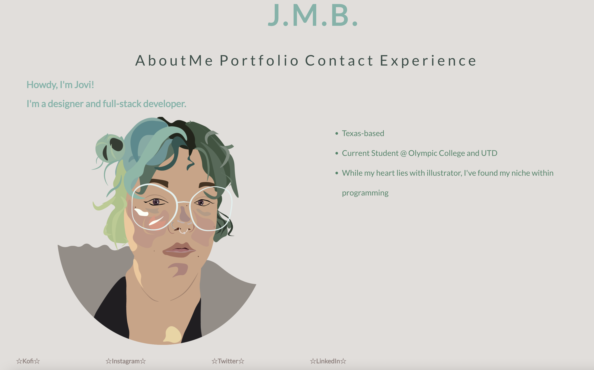
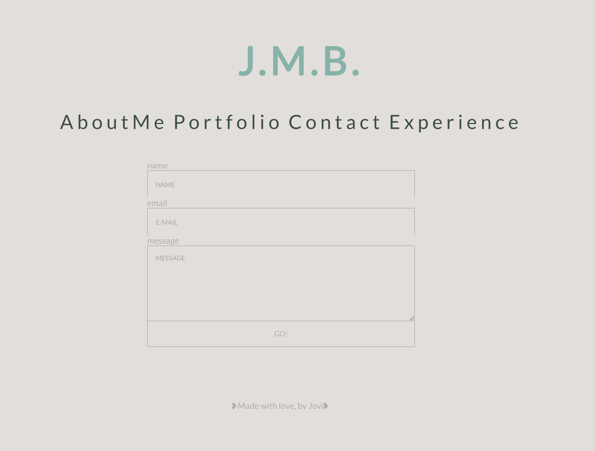

## React Portfolio

## Description
This is a portfolio devised from react! Throughout the course, we have developed projects to place within our portfolios. (We have one more left!!) These can be updated, as needed, throughout our careers. How neat.

## Screenshots

## User Story
-- AS AN employer looking for candidates with experience building single-page applications
-- I WANT to view a potential employee's deployed React portfolio of work samples
-- SO THAT I can assess whether they're a good candidate for an open position

## Installation: `npm start`

Open [http://localhost:3000](http://localhost:3000) to view it in your browser.

OR 

follow the link as below

THEN

explore the website! use "about me" to return to the homepage (-:

## Deployed Link

